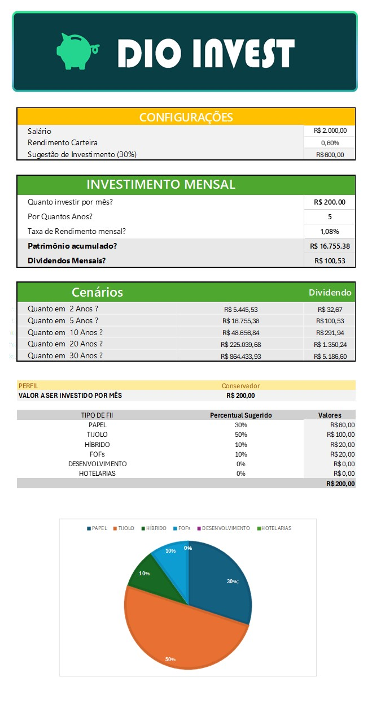

# Simulador de Investimentos - Desafio DIO

Este projeto consiste em uma planilha Excel que simula uma distribuição de investimentos com base no perfil do investidor.

## 🧠 Funcionalidade

- O usuário informa seu perfil de investidor (Conservador, Moderado, Arrojado).
- A planilha retorna uma recomendação de alocação em fundos imobiliários (FIIs).

## 📁 Arquivos

- [Dio_Invest.xlsx](./Dio_Invest.xlsx): Planilha principal do simulador.

## 🛠️ Tecnologias utilizadas

- Microsoft Excel
- Lógica de negócios baseada em regras (na aba TB_Apoio)

## 📌 Desafio proposto pela DIO

## 🖼️ Demonstração da Planilha

### Tela principal do simulador  

